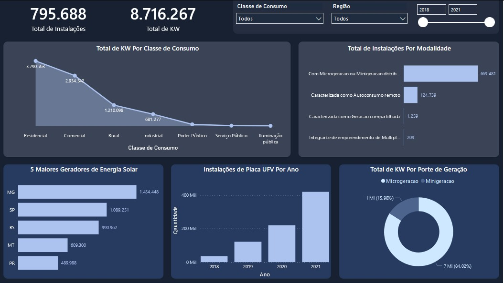
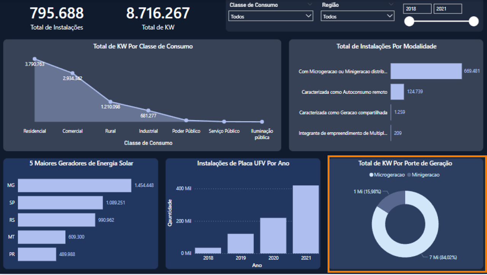

# Projeto de Análise de Geração Distribuída Através de Painéis Solares com Power BI

## Objetivo
Realizar uma análise descritiva da instalação de painéis fotovoltaicos provenientes de geração distribuída no Brasil entre os anos de 2018 e 2021, buscando compreender a dinâmica de produção e consumo.

## Equipe

- [Aline Emanuela](https://github.com/alinemanuela)
- [Henrique Freitas](https://github.com/henriqsf)
- [Tamires Souza](https://github.com/tamiresouza)
- [Wiliams Alves](https://github.com/alves05)

## Sobre a Base de Dados
A base de dados utilizada foi a [Brazil Solar Panel Generation Data](https://www.kaggle.com/datasets/luccagodoy/empreendimento-gerao-distribuda-aneel) dados do governo brasileiro sobre a instalações de painéis solares em todo país.

## Arquivos do Projeto

- [Relatório PowerBI](./relatorio/)
- [Base de Dados](./base_dados/)
- [Template/ Gráficos/ Fluxograma](./img/)

## Dashboard Power BI
>Clique na imagem abaixo para acessar o dashboard.

## Fluxograma do Projeto:

## Contextualização

Uma empresa está atualmente conduzindo pesquisas sobre novos mercados no Brasil. Um dos segmentos que desperta especial interesse é o de geração distribuída de energia solar. Com o objetivo de aprofundar a compreensão de alguns aspectos cruciais desse mercado, como seus principais consumidores, os diretores decidiram mobilizar sua equipe de cientistas de dados. A missão atribuída a esses profissionais é elaborar uma análise abrangente relacionada à geração de energia solar.

## Questões levantadas Pelos Diretores

### 1. Qual região teve os maiores números de instalações no período analisado?

Foram identificadas 297.202 instalações entre os anos de 2018 e 2021 na região Sudeste do país. Isso equivale a 37,35% de todas as instalações no país no período.

### 2. O interesse maior em gerar energia solar foi para a classe residencial?

Observou-se que a classe residencial lidera em número de instalações e consumo de energia solar, representando expressivos 43,49% do mercado consumidor de energia.

### 3. Residências que geram energia solar tendem a qual tipo de distribuição?

A distribuição predominante nessa classe de consumo é "Com Microgeração ou Minigeração Distribuída". Para entendermos o motivo, devemos conhecer cada tipo, começando pelo mais popular: "Com Microgeração ou Minigeração Distribuída". Esse tipo de distribuição destina-se a centrais geradoras com potência instalada de até 75 kW.

Já a "Caracterizada como Autoconsumo Remoto" permite que a pessoa física que possua dois ou mais imóveis compartilhe os créditos de energia entre os imóveis. A "Caracterizada como Geração Compartilhada" é a possibilidade de geração de energia em grupo, por exemplo, moradores de um condomínio que se juntam para compartilhar os custos e os créditos da produção de energia solar. Por fim, temos a "Integrante de Empreendimento de Múltiplas UC (Unidades Consumidoras)", que se trata de empreendimentos geradores de energia.

### 4. Os maiores geradores de energia solar são estados do nordeste?

Surpreendentemente, os estados da região Nordeste não ocupam as posições de destaque no ranking das regiões com maior instalação e geração de energia solar, encontrando-se fora das cinco primeiras posições. Destaca-se o estado de Minas Gerais (MG), ocupando a liderança nacional na instalação e geração de energia. Podemos atribuir a esses números os incentivos estaduais aplicados no período da análise, por meio do "Projeto Sol de Minas" da Secretaria de Desenvolvimento Econômico. Foram implementadas isenções tributárias, a fim de promover a adesão a sistemas de geração distribuída, por meio da lei estadual n° 23.762/2021.

### 5. A modalidade influencia o crescimento da capacidade instalada ao longo dos anos? 

Foi constatado que sim, as modalidades influenciaram no crescimento, com destaque  para a "Com Microgeração ou Minigeração Distribuída" predominantemente na classe de consumo residencial.

### 6. Quais os portes das estações de geração de energia solar?

Os portes de estações identificados foram categorizados como "Microgeração" e "Minigeração". Destaca-se uma predominância significativa na categoria "Microgeração", representando 84% do total, em contraste com a "Minigeração", que equivale a aproximadamente 16%. Essa distribuição pode ser atribuída à modalidade de consumo, principalmente residencial, sugerindo uma correlação entre a preferência por microgeração e o uso doméstico de energia.

## Conclusão

A pesquisa sobre geração distribuída por meio de painéis solares evidenciou uma preferência significativa pela microgeração e geração distribuída, especialmente em ambientes residenciais. Os benefícios positivos dessa forma de energia incluem a diminuição das emissões de gases de efeito estufa, a geração de empregos na indústria de energia renovável e um aumento na resiliência energética. A economia associada à energia solar é impulsionada por incentivos governamentais, exemplificados pelo estado de Minas Gerais (MG), que lidera o país em instalações e na geração de energia nos anos 2018 à 2021. Os avanços tecnológicos contribuem para tornar a energia solar uma opção sustentável e economicamente viável. A transição para a energia solar não apenas atende às exigências ambientais, mas também estimula o desenvolvimento econômico, solidificando seu papel como protagonista no cenário energético futuro.

A condução dessa análise contou com a aplicação crucial das técnicas de ETL e storytelling, integradas ao Power BI, uma ferramenta excelente que agilizou a elaboração do relatório e simplificou a apresentação dos dados. Isso nos permitiu apresentar as informações de maneira clara e objetiva, além de extrair insights valiosos para o negócio.

Em síntese, a utilização da ciência de dados na realização de estudos significativos que influenciam a vida e o cotidiano da população é essencial. A compreensão desses dados nos permite entender a situação atual e nos preparar para o futuro.