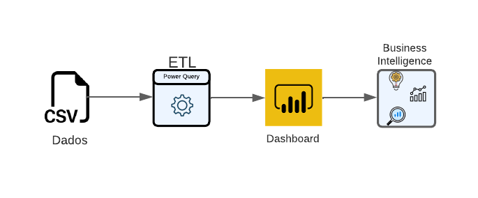
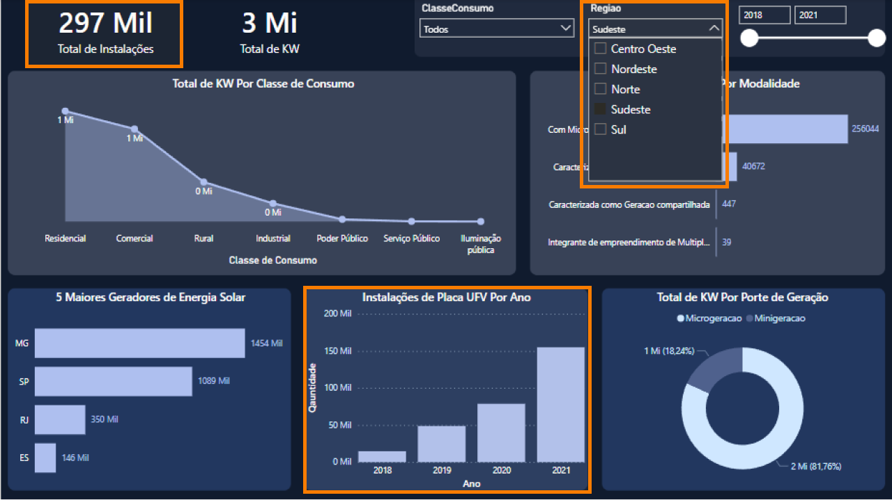
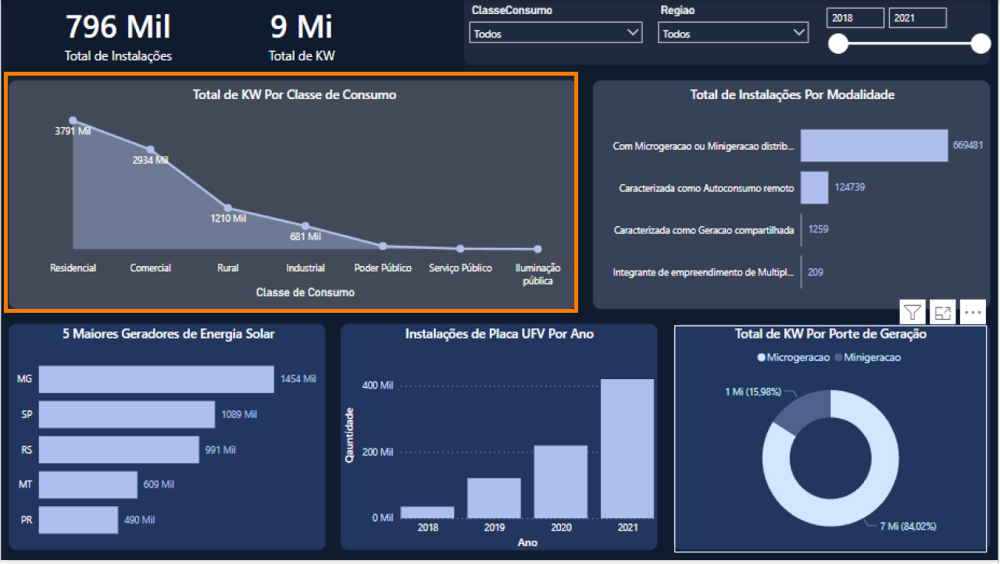
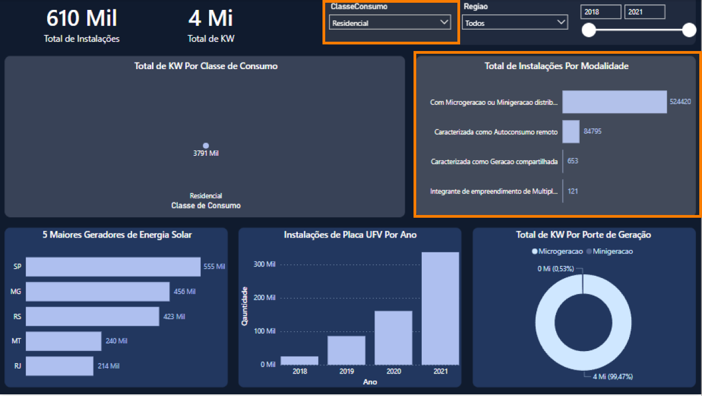
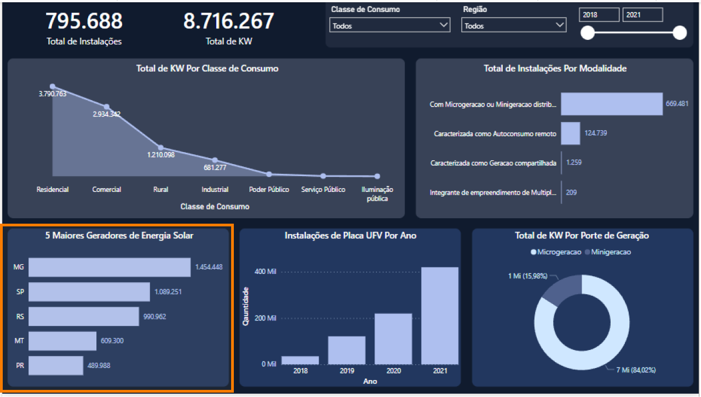
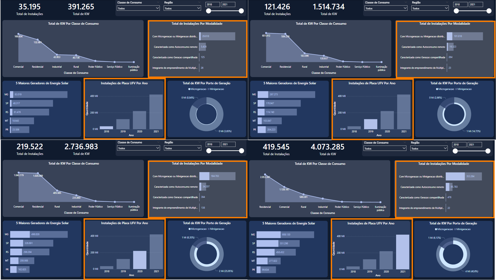

# Projeto de Análise de Geração Distribuída Através de Painéis Solares com Power BI

## Objetivo
Realizar uma análise descritiva da instalação de painéis fotovoltaicos provenientes de geração distribuída no Brasil entre os anos de 2018 e 2021, buscando compreender a dinâmica de produção e consumo.

## Equipe

- [Aline Emanuela](https://github.com/alinemanuela)
- [Henrique Freitas](https://github.com/henriqsf)
- [Tamires Souza](https://github.com/tamiresouza)
- [Wiliams Alves](https://github.com/alves05)

## Sobre a Base de Dados
A base de dados utilizada foi a [Brazil Solar Panel Generation Data](https://www.kaggle.com/datasets/luccagodoy/empreendimento-gerao-distribuda-aneel) dados do governo brasileiro sobre a instalações de painéis solares em todo país.

## Arquivos do Projeto

- [Relatório PowerBI](./relatorio/)
- [Base de Dados](./base_dados/)
- [Template](./img/template/)

## Dashboard Power BI
>Clique na imagem abaixo para acessar o dashboard.

## Fluxograma do Projeto:

## Contextualização

Uma empresa está atualmente conduzindo pesquisas sobre novos mercados no Brasil. Um dos segmentos que desperta especial interesse é o de geração distribuída de energia solar. Com o objetivo de aprofundar a compreensão de alguns aspectos cruciais desse mercado, como seus principais consumidores, os diretores decidiram mobilizar sua equipe de cientistas de dados. A missão atribuída a esses profissionais é elaborar uma análise abrangente relacionada à geração de energia solar.

## Questões levantadas Pelos Diretores

### 1. Qual região teve os maiores números de instalações no período analisado?

Foram identificadas 297 mil instalações entre os anos de 2018 e 2021 na região sudeste do país.

### 2. O interesse maior em gerar energia solar foi para a classe residencial?

Observou-se que a classe residencial lidera em número de instalações e consumo de energia solar, representando expressivos 43,49% do mercado consumidor de energia.

### 3. Residências que geram energia solar tendem a qual tipo de distribuição?

A distribuição predominante nessa classe de consumo é "Com Microgeração ou Minigeração Distribuida".

### 4. Os maiores geradores de energia solar são estados do nordeste?

Surpreendentemente, os estados da região Nordeste não ocupam as posições de destaque no ranking das regiões com maior instalação e geração de energia solar, encontrando-se fora das cinco primeiras posições.

### 5. A modalidade influencia o crescimento da capacidade instalada ao longo dos anos? 

Foi constatado que sim, as modalidades influenciaram no crescimento, com destaque  para a "Com Microgeração ou Minigeração Distribuída" predominantemente na classe de consumo residencial.

## Conclusão

Qual a taxa de energia solar gerada em relação a produção nacional?

O custo médio da instalação é compensatório em relação a produção de energia?

insentivos fiscais

A média nacional é de R$ 0,72 por KWh (fonte ago/2023)
